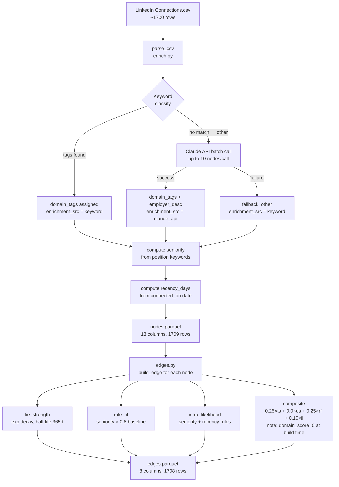
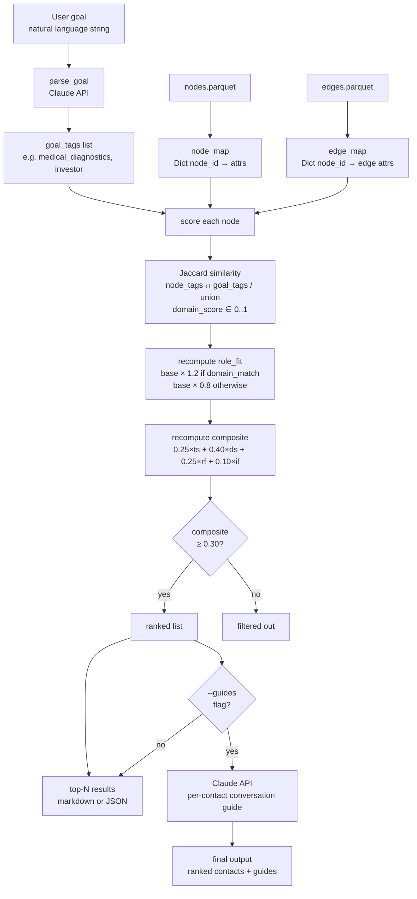

# NetWeave Engineering Document
**Version:** 1.0 — June 2026  
**Status:** v1 production + lab research phase

---

## 1. System Purpose

NetWeave is a goal-driven introduction engine. Given a business development goal in natural language, it ranks a user's LinkedIn network by likelihood of producing a warm introduction relevant to that goal. The output is a ranked contact list with composite scores and optional conversation guides.

The **NetWeave Intelligence Workbench (NIW)** in `netweave-lab/` is the research harness for testing design alternatives before promoting them to production.

---

## 2. High-Level Architecture

```
┌─────────────────────────────────────────────────────────────────┐
│                        DATA PIPELINE                            │
│                                                                 │
│   LinkedIn           Enrichment          Edge                   │
│   Export    ──────►  Engine     ──────►  Builder   ──────►  DB  │
│  (CSV)      Step 2   (enrich.py) Step 3  (edges.py)             │
└─────────────────────────────────────────────────────────────────┘
                                                      │
                                                      ▼
┌─────────────────────────────────────────────────────────────────┐
│                        QUERY ENGINE                             │
│                                                                 │
│   Natural Language Goal  ──────►  parse_goal()  ──────►         │
│                                   (Claude API)                  │
│                                        │                        │
│                                        ▼                        │
│                              Score all nodes                    │
│                              (Jaccard + composite)              │
│                                        │                        │
│                                        ▼                        │
│                              Ranked contact list + guides       │
└─────────────────────────────────────────────────────────────────┘
                                                      │
                                                      ▼
┌─────────────────────────────────────────────────────────────────┐
│                     RESEARCH HARNESS (NIW)                      │
│                                                                 │
│   netweave-lab/experiments/   ──────►  MLflow DB                │
│   (EXP001–EXP007 notebooks)            (local SQLite)           │
│                                              │                  │
│                                              ▼                  │
│                              Validated decision → PR to         │
│                              netweave/src/                      │
└─────────────────────────────────────────────────────────────────┘
```

---

## 3. Data Flow: Enrichment Pipeline



**Key columns produced:**

| File | Key Columns |
|------|-------------|
| `nodes.parquet` | node_id, first_name, last_name, company, position, domain_tags, seniority, recency_days, employer_desc, enrichment_src |
| `edges.parquet` | source_id, target_id, tie_strength, domain_score, role_fit, seniority, intro_likelihood, composite |

---

## 4. Data Flow: Query Engine



**Composite weight breakdown at query time:**

| Signal | Weight | Notes |
|--------|--------|-------|
| domain_score | 40% | Jaccard(node_tags, goal_tags) — largest driver |
| tie_strength | 25% | Recency decay (exp, half-life 365d) |
| role_fit | 25% | Seniority × domain_match multiplier |
| intro_likelihood | 10% | Seniority + recency rules |

---

## 5. Graph Topology

The current graph is a **pure star**: every edge runs from Chuck's node to a first-degree connection. There are no edges between leaf nodes.

```
                    ┌──────────────┐
                    │  Chuck Hahm  │  (hub node)
                    └──────┬───────┘
          ┌─────────────────┼─────────────────┐
          │                 │                 │
          ▼                 ▼                 ▼
    [Investor A]      [Biotech B]      [Medical C]   ... ×1708
    composite=0.62    composite=0.44   composite=0.38
```

**Consequences:**
- NDCG evaluation using recency-only ranking (EXP001) gives identical scores across all decay functions — the relevant domain experts are old connections that rank 895–1443 under any decay function
- No path-finding is possible yet (A → Chuck → B is the only path length = 2)
- v2 design (`expand.py`) plans to add second-degree nodes, which would create a real network topology

---

## 6. Domain Tag Distribution (Current Graph)

| Tag | Count | % | Issue |
|-----|-------|---|-------|
| other | 1,199 | 70.2% | Unenriched — no useful signal |
| startup | 128 | 7.5% | |
| medical_diagnostics | 85 | 5.0% | |
| academia | 84 | 4.9% | |
| connector | 66 | 3.9% | |
| investor | 53 | 3.1% | |
| GovCon | 33 | 1.9% | |
| grid_tech | 28 | 1.6% | |
| biotech | 23 | 1.3% | |
| defense | 8 | 0.5% | |
| energy_storage | 1 | 0.1% | |

**70% of nodes are tagged "other"** — this directly limits query result quality because domain_score = 0 for all of them, reducing their composite by 40 percentage points versus a matched node.

---

## 7. Seniority Distribution

| Seniority | Count | % |
|-----------|-------|---|
| unknown | 449 | 26.3% |
| ic | 349 | 20.4% |
| executive | 299 | 17.5% |
| manager | 270 | 15.8% |
| founder | 182 | 10.7% |
| director | 160 | 9.4% |

26% unknown seniority means role_fit defaults to 0.2 (lowest tier) for those nodes — likely undercounting many senior contacts whose titles don't match the keyword rules.

---

## 8. Gap Analysis

### 8.1 Critical Gaps

**G1 — Star graph has no topology**  
The graph has 1709 nodes and 1708 edges — all edges from one source. There are no paths of length > 2. This means: no intro path ranking (A asks B to introduce C), no clustering by relationship, and no second-degree discovery. This is the single largest structural limitation.

**G2 — 70% of nodes have no domain signal**  
Nodes tagged "other" score 0.0 on domain_score, which carries 40% of the composite weight. The query engine effectively ignores 70% of the network. The Claude API enrichment pass is not being run on the bulk of the network.

**G3 — domain_score is not persisted on edges**  
`edges.parquet` stores `domain_score = None`. The composite stored in the file is computed with domain_score = 0, making it a misleading pre-computation. The real composite is recomputed fresh at every query. This means cached edge data doesn't reflect actual relevance.

**G4 — Synthetic ground truth limits experiment validity**  
`build_ground_truth()` selects nodes by Jaccard ≥ 0.5 + senior seniority. This is circular: the same Jaccard logic used to score nodes is also used to define "relevant." NDCG results measure self-consistency, not actual quality.

**G5 — tie_strength alone has no discriminating power for domain goals**  
EXP001 confirmed: when the relevant nodes are old connections (recency_days > 1000), all decay functions produce identical rankings. tie_strength only differentiates recent connections, but domain experts in a network are often older contacts.

### 8.2 Design Debt

**D1 — Seniority classifier is keyword-only**  
26% unknown seniority. The position-to-seniority mapping covers common English titles but misses domain-specific roles ("Principal Investigator" → should be director/executive, "Attending Physician" → should be executive).

**D2 — geography is extracted by regex against 15 US cities**  
International contacts, suburbs, and non-city geographies all return None. Geography is not currently used in scoring but is expected to be useful for warm intro routing.

**D3 — expand.py is a stub**  
Second-degree expansion returns an empty list. This is the planned v2 feature, but until it ships the graph will remain a star.

**D4 — No feedback loop**  
There is no mechanism to record whether an intro was made, whether it resulted in a meeting, or whether the meeting was productive. Without feedback, the composite weights cannot be calibrated against real outcomes.

**D5 — Single-user design**  
The hub node is hardcoded to `CHUCK_LINKEDIN_URL`. The architecture doesn't support multiple users or shared network graphs.

---

## 9. Improvement Recommendations

### Priority 1: Fix the domain enrichment gap (highest ROI)

**Problem:** 1199 nodes are tagged "other." Each costs 40% of its composite score.  
**Fix:** Run the Claude API enrichment pass on all "other" nodes. At ~$0.002 per node (Claude Haiku), the full pass costs ~$2.40. This single change would give useful domain signal to 70% of the network.

```bash
# Re-enrich other nodes with API
python src/enrich.py --max-api-nodes 1200 --force-re-enrich-other
```

Expected impact: composite scores for ~1199 nodes become meaningful; query recall improves dramatically.

---

### Priority 2: Run EXP002 (domain classifier quality)

**Problem:** Even with API enrichment, the classifier prompt and taxonomy may be inaccurate.  
**Fix:** EXP002 compares keyword-only vs. zero-shot vs. few-shot Claude classification on 30 manually labeled nodes. Run this before doing the bulk re-enrichment so you're enriching with the best classifier, not the default one.

---

### Priority 3: Add second-degree nodes (structural fix)

**Problem:** The star topology has no path structure — no intro routing is possible.  
**Fix (v2):** Build second-degree edges by:
1. For each first-degree connection, fetch their public LinkedIn connections (via OSINT or manual export)
2. Add those as nodes connected to the first-degree node (not to Chuck)
3. Paths Chuck → A → B now become rankable intro chains

```
         Chuck
          │ │
          A   B     ← first-degree (current graph)
         / \   \
        C   D   E   ← second-degree (v2 expansion)
```

This is what EXP003 (FAISS index), EXP006 (pathfinding), and EXP007 (second-degree signal) are designed to validate before v2 ships.

---

### Priority 4: Persist domain_score on edges

**Problem:** The composite in `edges.parquet` is computed with domain_score = 0, making it misleading.  
**Fix:** Pre-compute and store domain_score for your most common goal templates (e.g., LipoNexus = medical_diagnostics + investor). This makes the stored composite meaningful and enables offline analysis.

```python
# In edges.py, add:
COMMON_GOALS = {
    "lipnexus": ["medical_diagnostics", "biotech", "investor"],
    "grid":     ["grid_tech", "energy_storage"],
}
# Store pre-scored composites as columns: composite_lipnexus, composite_grid, etc.
```

---

### Priority 5: Manual ground truth for EXP evaluation

**Problem:** Synthetic ground truth from `build_ground_truth()` is circular.  
**Fix:** For the LipoNexus goal specifically, manually label 20–30 nodes as relevant/not-relevant based on your actual knowledge of your network. Store in `experiments/ground_truth_lipnexus.json`. Use this as the `relevant_set` for all NDCG evaluations going forward.

---

### Priority 6: Improve seniority classifier

**Problem:** 26% of nodes have unknown seniority, defaulting to role_fit = 0.2.  
**Fix (two options):**

Option A — Expand keyword list in `enrich.py`:
```python
# Add to existing seniority rules:
"executive": ["principal investigator", "attending physician", "chief", "president", "vp ", "head of"],
"director":  ["sr. manager", "senior manager", "associate professor", "research director"],
```

Option B — Use Claude API to classify seniority for unknown nodes (bundle with domain re-enrichment).

---

### Priority 7: Add outcome tracking

**Problem:** No feedback loop to calibrate weights.  
**Fix:** Add a lightweight outcome log to track intro attempts and results:

```python
# outcomes.jsonl
{"date": "2026-06-25", "node_id": "...", "action": "intro_requested", "result": "meeting_booked"}
{"date": "2026-06-28", "node_id": "...", "action": "intro_requested", "result": "no_response"}
```

After 20–30 logged outcomes, use the data to calibrate composite weights via EXP006 or a simple logistic regression.

---

## 10. Experiment-to-Production Dependency Map

```
EXP002 (domain classifier)
    └─► informs bulk re-enrichment quality
            └─► feeds EXP004 (employer_desc signal value)
                    └─► informs enrich.py prompt design

EXP001 re-run (composite ranking)
    └─► validates tie_strength weight in composite formula
            └─► informs edges.py DEFAULT_WEIGHTS

EXP003 (FAISS index)
    └─► required before v2 second-degree expansion
            └─► informs expand.py index type

EXP006 (pathfinding)
    └─► required for intro routing in v2
            └─► informs query.py path selection

EXP007 (second-degree signal)
    └─► validates which OSINT signals to collect in v2
            └─► informs expand.py relevance scorer

EXP005 (layout readability)
    └─► informs Cytoscape default layout for client deliverables
            └─► informs query.py --layout parameter (v2)
```

**Recommended experiment order for maximum impact:**

```
EXP002 → bulk re-enrich → EXP004 → EXP001-rerun
                                         │
                                         ▼
                                EXP003 → EXP007 → EXP006 → v2 expand.py
```

---

## 11. Quick Wins (No Experiment Needed)

| Action | Effort | Impact |
|--------|--------|--------|
| Re-enrich 1199 "other" nodes via Claude API | 1 hour + ~$2.40 | High — 70% of network gains domain signal |
| Expand seniority keyword list for 449 unknowns | 30 min | Medium — better role_fit scores |
| Hand-label 30 ground truth nodes for LipoNexus | 2 hours | High — makes all NDCG metrics meaningful |
| Run EXP001 again using composite as ranking signal | 1 hour | Medium — closes the open question from EXP001 |
| Add `prior_engagement=True` for contacts you've met | 30 min | Low now, high when engagement is weighted |
